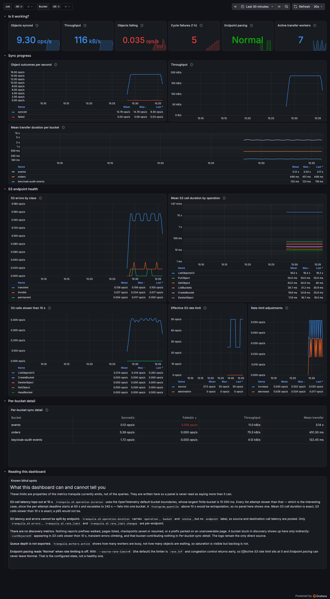

# Grafana dashboard



`tranquila-dashboard.json` is a Grafana dashboard for a tranquila deployment scraped by
Prometheus. It answers the questions an operator asks during an incident — is anything moving,
is anything failing, is the endpoint the problem, which bucket is stuck — without reading logs.

Requires Grafana 10 or newer and a Prometheus data source.

## Install

**Import through the UI.** Dashboards → New → Import → Upload JSON file, then pick the
Prometheus data source when prompted. The dashboard declares a `DS_PROMETHEUS` data-source
variable, so it is not pinned to one Grafana instance.

**Or provision it from a file.** Mount the JSON into Grafana and point a file provider at it:

```yaml
# /etc/grafana/provisioning/dashboards/tranquila.yml
apiVersion: 1
providers:
  - name: tranquila
    type: file
    options:
      path: /var/lib/grafana/dashboards
```

A provisioned dashboard resolves `${DS_PROMETHEUS}` against the data source selected in the
variable picker, so the datasource variable is kept rather than hard-coded.

## Install with grafana-operator

For a cluster running [grafana-operator](https://github.com/grafana/grafana-operator) v5, the
dashboard ships as a `GrafanaDashboard` custom resource:

```shell
kubectl apply -k deploy/grafana
```

That generates a ConfigMap holding the dashboard model and a `GrafanaDashboard` referencing it.
The model is **not** inlined in the CR — it is read from `tranquila-dashboard.json`, the same file
the UI import path uses, so the two cannot drift apart.

Without kustomize, the same two objects by hand:

```shell
kubectl create configmap tranquila-dashboard --from-file=tranquila-dashboard.json
kubectl apply -f deploy/grafana/grafanadashboard.yaml
```

Two things usually need editing in [`grafanadashboard.yaml`](grafanadashboard.yaml):

* **`spec.instanceSelector`** must match the labels on your `Grafana` CR. It ships as
  `dashboards: grafana`, the operator's own example label. If it does not match, nothing is
  imported and the CR's status reports `NoMatchingInstances` — the apply itself still succeeds,
  so check the status rather than the exit code.
* **`spec.allowCrossNamespaceImport`** must be set if the `Grafana` CR is in another namespace.
  It defaults to false, and turning it back off later requires recreating the resource.

The datasource needs no configuration: it is a template variable, and Grafana resolves it to the
default Prometheus datasource with no input. This was verified by loading the model with no
datasource selected and no URL parameters — the picker resolved itself and every panel returned
data. If you run more than one Prometheus, or want the choice declarative rather than defaulted,
pin it with `spec.variables` (commented out in the manifest):

```yaml
  variables:
    - name: DS_PROMETHEUS
      value: prometheus       # datasource UID or name
```

Editing the ConfigMap is enough to roll out a dashboard change — the operator re-reads the model
every `spec.resyncPeriod` (10m as shipped), and nothing needs restarting. The generated ConfigMap
deliberately has **no name hash**: kustomize rewrites ConfigMap references in built-in types but
not in a custom resource's `spec.configMapRef`, so a hashed name would leave the CR pointing at a
name that does not exist.

## Scrape configuration

Run tranquila with the Prometheus exporter (the default; `--telemetry-addr` defaults to `:8081`):

```yaml
sync:
  telemetry:
    exporter: prometheus
    addr: :8081
```

and scrape `/metrics` on that address. The dashboard's `Job` variable is populated from
`tranquila_s3_rate_limit_per_second`, which is an observable gauge and is therefore exported from
process start — the counters only appear once something has been synced, so they are not usable
for variable discovery on an idle instance.

## What each row shows

| Row | Answers |
| --- | --- |
| **Is it working?** | Six stat tiles: sync rate, throughput, failure rate, cycle failures in the last hour, whether congestion control has degraded an endpoint, and how many workers are busy. |
| **Sync progress** | Successful versus failed transfers over time, throughput, and mean transfer duration per bucket. |
| **S3 endpoint health** | Errors by class, mean S3 call duration per operation, calls past the 10 s histogram ceiling, the effective rate limit, and congestion-control adjustments. |
| **Discovery** | Parked prefixes per bucket — sharded-discovery prefixes stuck on a checkpointed page the backend still can't answer. |
| **Per-bucket detail** | The same numbers as text, one row per bucket, sorted by failure rate. |
| **Reading this dashboard** | The dashboard's own blind spots — read this before trusting a panel. |

## Known blind spots

These are properties of the metrics tranquila emits, not of the queries. They are repeated in a
panel on the dashboard itself, and the reasoning is in
[ADR 0004](../../docs/adr/0004-grafana-dashboard.md).

* **S3 call latency tops out at 10 s.** `tranquila.s3.operation.duration` uses the OpenTelemetry
  default bucket boundaries, so every list attempt slower than 10 s — which is the interesting
  case, given a per-attempt deadline that starts at 60 s and escalates to 240 s — falls into one
  bucket. No panel shows a quantile, because above 10 s a quantile is extrapolation. *Mean S3
  call duration* and *S3 calls slower than 10 s* are both exact.
* **S3 latency cannot be split by endpoint.** That histogram carries `operation`, `bucket` and
  `status`, but no `endpoint`, so source and destination latency are pooled. Errors, rate limit
  and rate-limit changes are per-endpoint.
* **Discovery has one metric: parked prefixes.** `tranquila.s3.discovery.parked_prefixes` (per
  bucket, *Discovery → Parked prefixes by bucket*) counts prefixes that resumed onto a
  checkpointed page the backend still could not answer, as of the last completed cycle. A bucket
  with no line on that panel has not completed a sharded-discovery cycle yet, not a real zero —
  the same distinction `tranquila status`'s `PARKED` column draws between `-` and `0`. Nothing
  else about discovery is exported: pages listed, checkpoints saved/resumed, and everything else
  about a struggling bucket still shows up only indirectly — `ListObjectsV2` in *S3 calls slower
  than 10 s*, transient errors climbing, and that bucket contributing nothing in *Per-bucket sync
  detail*. Logs remain the direct source for everything else.
* **Queue depth is not exported.** `tranquila.workers.active` shows how many workers are busy, not
  how many objects are waiting, so saturation is visible but backlog is not.
* **Endpoint pacing reads "Normal" when rate limiting is off.** With `--source-rate-limit=0` (the
  default) the limiter is `rate.Inf` and congestion control returns early, so *Effective S3 rate
  limit* sits at 0 and *Endpoint pacing* can never leave Normal. That is the configured state,
  not a healthy one.

## Accessibility

Every series colour is fixed per entity rather than per rank, so filtering never repaints the
surviving series. The eight hues are validated against both Grafana surfaces — light `#ffffff`
and dark `#181b1f` — and clear the lightness band, chroma floor, adjacent colour-vision-deficiency
separation, the normal-vision floor and 3:1 contrast in both themes, so the dashboard is readable
under either theme and under CVD. Every panel carries a legend with numeric values, and any panel
can be read as a table through its menu → Inspect → Data; *Per-bucket sync detail* is the table
view for the dashboard as a whole.

## Metrics used

| Metric (OpenTelemetry) | Prometheus series | Labels |
| --- | --- | --- |
| `tranquila.objects.synced` | `tranquila_objects_synced_total` | `bucket` |
| `tranquila.objects.failed` | `tranquila_objects_failed_total` | `bucket` |
| `tranquila.bytes.transferred` | `tranquila_bytes_transferred_total` | `bucket` |
| `tranquila.transfer.duration` | `tranquila_transfer_duration_seconds` | `bucket` |
| `tranquila.workers.active` | `tranquila_workers_active` | — |
| `tranquila.sync.cycle.failures` | `tranquila_sync_cycle_failures_total` | — |
| `tranquila.s3.operation.duration` | `tranquila_s3_operation_duration_milliseconds` | `operation`, `bucket`, `status` |
| `tranquila.s3.errors` | `tranquila_s3_errors_total` | `endpoint`, `class` |
| `tranquila.s3.rate_limit.changes` | `tranquila_s3_rate_limit_changes_total` | `endpoint`, `direction` |
| `tranquila.s3.rate_limit` | `tranquila_s3_rate_limit_per_second` | `endpoint` |
| `tranquila.s3.rate_limit.degraded` | `tranquila_s3_rate_limit_degraded` | `endpoint` |

The Prometheus names are what the OpenTelemetry exporter actually produces, including its unit
suffixes (`{call}/s` becomes `_per_second`); they were read off a live `/metrics` endpoint rather
than derived from the naming rules.
